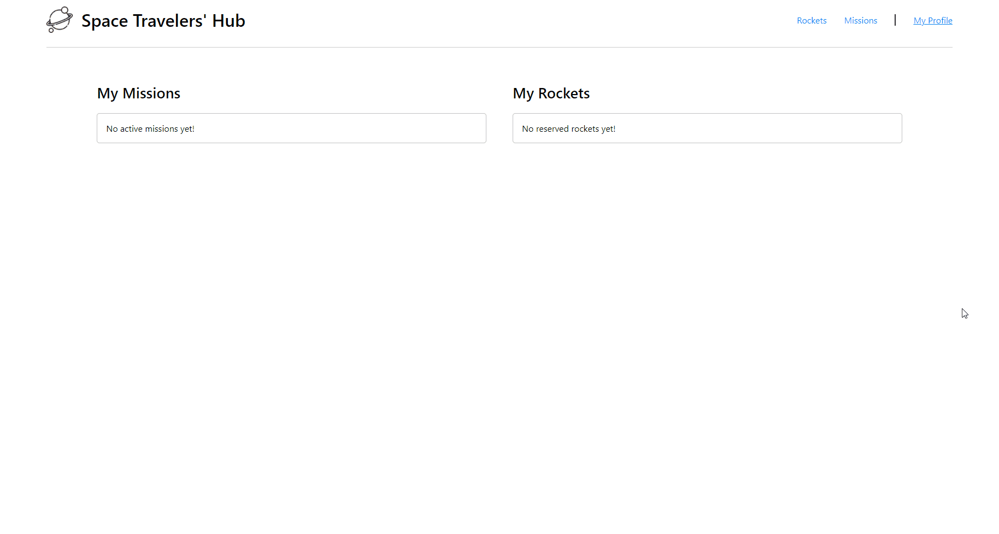

# Space Travelers' Hub

> It is an app you can use to reserve and cancel rockets, and join and leave missions by SpaceX. Also, you can track your reservations and missions in 'My Profile' section. This App was created using React&Redux and [SpaceX's API](https://api.spacexdata.com).

  

## Built With

- HTML5, CSS3
- React
- Jest

## Live Demo

- [Click here to see a live version!](https://space-travelers-rdnrn-dire.herokuapp.com/)

## Getting Started

To get a local copy up and running follow these steps:

1. Click the green button "Clone" and choose a preferable way of cloning.
2. Clone the project to your local machine.
3. Open the project folder in your favorite IDE (Preferably Visual Studio Code).
4. Click "View" and choose "Terminal" in the dropdown menu.
5. Enter `npm i` in the terminal to install all dependencies.
6. Enter `npm start` in the terminal to run the project on your local server.

## Authors

👤 **Nana Rodina**

- GitHub: [@rdnrn](https://github.com/rdnrn)
- LinkedIn: [Nana Rodina](https://www.linkedin.com/in/arina-rodina-144612219/?locale=en_US)
- Twitter: [nana](https://twitter.com/rdnrn_nana)

👤 **Dire Akanbi**

- GitHub: [@direakanbi](https://github.com/direakanbi)
- Twitter: [@Dire Akanbi](https://twitter.com/DireAkanbi)
- LinkedIn: [Akanbi Dire](https://www.linkedin.com/in/dire-akanbi-63bbbb217)

## 🤝 Contributing

Contributions, issues, and feature requests are welcome!

[You can leave them here!](https://github.com/rdnrn/mathmagicians/issues)

## Show your support

Give a ⭐️ if you like this project!
